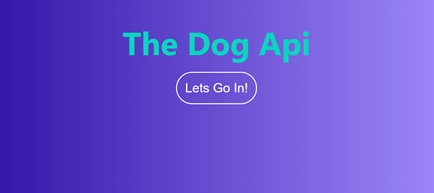
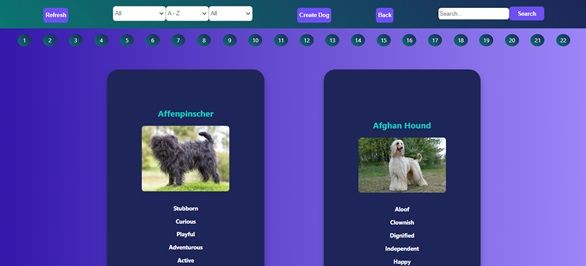
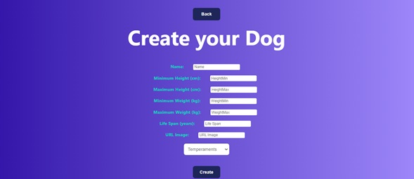

# Henry - Proyecto Individual - “The Dog API”

  

Proyecto individual para Henry el cual consta del desarrollo de una SPA (Single Page Application) utilizando React para el Front End y Redux como state management. Los componentes fueron desarrollados con CSS sin uso de librerías externas.

La SPA consume datos de una API (“the dog api”) a través de un Back End desarrollado en Node.js utilizando Express.

Features del proyecto que se destacan: Búsquedas por nombre, ordenamientos y filtros, formulario controlado, entre otros.

**Home:**

  

**Create:**

  

**Para visualizar el proyecto**
* Clonar el repositorio
* En la terminal ejecutar los siguientes comandos en las carpetas api y client, respectivamente
* npm install
* npm start
* En el navegador dirigirse a http://localhost:3000/

